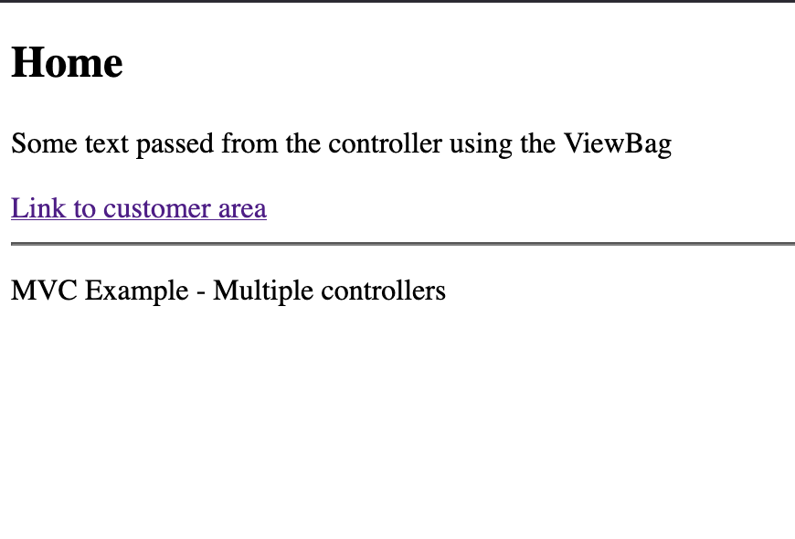
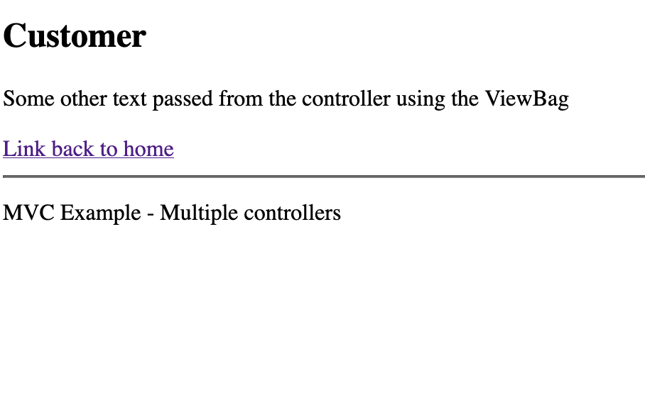

### Overview
This example shows how to make application that has more than one controller and uses action links to go from one controller to the other.

## View

In the view we show the information sent from the controller. The action link will navigate to the Index function on the Customer controller.

```html
@{
    ViewBag.Title = "Index";
}
<h2>Home</h2>
<p>@ViewBag.SomeText</p>
@Html.ActionLink("Link to customer area", "Index", "Customer")
```

## Controller

In the controller for the index page, we read the customers from the model and pass that data to the view using the ViewBag.

```c#
public IActionResult Index()
{
    ViewBag.SomeText = "Some other text passed from the controller using the ViewBag";
    return View();
}
```

## Model

In the first example we have no database / data and therefore no model

## Screenshots

The application when executed looks like this



