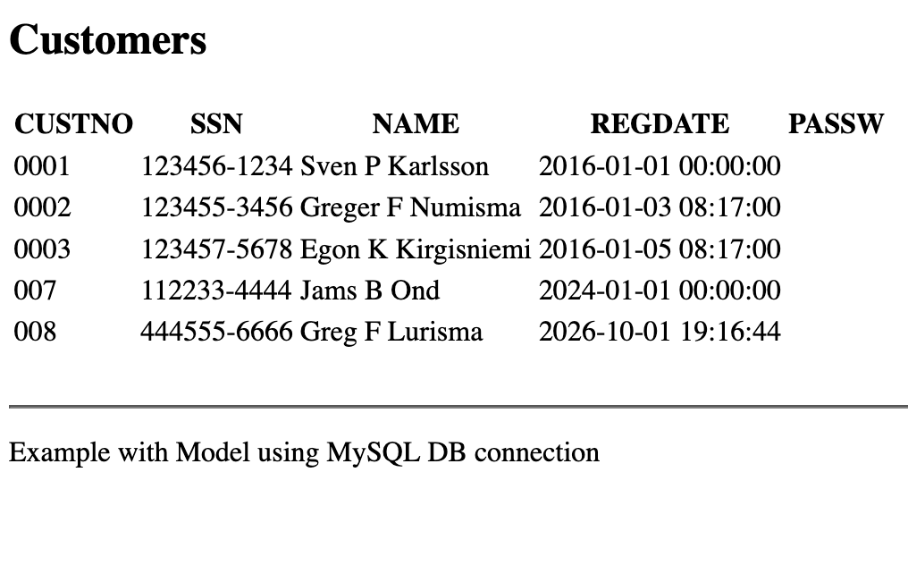

### Overview
This example shows how to make an insert using dotnet

## View

In the view we iterate over the data returned from the model through the controller. This code looks quite similar to the same code in PHP.

```html
<h2>Customers</h2>
<table>
    <tr>
        @foreach (var dataColumn in ViewBag.CustomerTable.Columns)
        {
            <th>@dataColumn.ColumnName</th>
        }
    </tr>
    @foreach (var customerRow in ViewBag.CustomerTable.Rows)
    {
      <tr>
      @for (int i = 0; i < ViewBag.CustomerTable.Columns.Count; ++i){
        <td>@customerRow[i]</td>
      }
      </tr>
    }
</table>
<br />
```

## Controller

In the controller for the index page, we read the customers from the model and pass that data to the view using the ViewBag

```c#
public IActionResult Index()
{
    CustomersModel customersModel = new CustomersModel(_configuration);
    ViewBag.CustomerTable = customersModel.GetAllCustomers();
    return View();
}
```

## Model

In the model we read the data from the table

```c#
public DataTable GetAllCustomers()
{
    MySqlConnection dbcon = new MySqlConnection(connectionString);
    dbcon.Open();
    MySqlDataAdapter adapter = new MySqlDataAdapter("SELECT * FROM CUSTOMER;", dbcon);
    DataSet ds = new DataSet();
    adapter.Fill(ds, "result");
    DataTable customerTable = ds.Tables["result"];
    dbcon.Close();

    return customerTable;
}
```

## Screenshots

The application when executed looks like this


