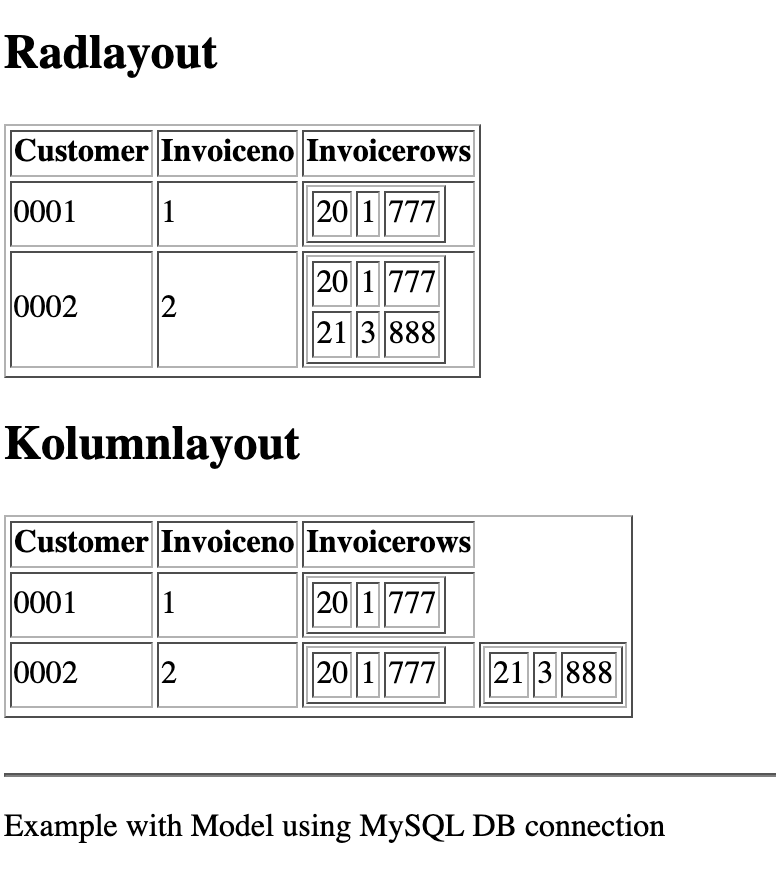

### Overview
This example shows how to make an insert using dotnet

## View

In the view the code looks mostly similar to the php  version of the same thing, we compare the previous row and only make outer table rows when the sorted value changes.

The inner table is then rendered using a second foreach.

The code example contains the same table using a row layout and a column layout.

```html
    @foreach (var customerRow in ViewBag.CustomerTable.Rows)
    {
      <tr>
      @if (prev != customerRow["INVOICENO"].ToString())
      {
          <td>@customerRow["CUSTNO"]</td>
          <td>@customerRow["INVOICENO"]</td> 
          <td><table border='1'>
          @foreach (var customerInnerRow in ViewBag.CustomerTable.Rows)
          {
              @if (customerInnerRow["INVOICENO"].ToString() == customerRow["INVOICENO"].ToString())
              {
                  <tr>
                    <td>@customerInnerRow["NUMBER"]</td>
                    <td>@customerInnerRow["PRODUCT"]</td>
                    <td>@customerInnerRow["COMPANY"]</td>          
                  </tr>          
              }
            }
          </table></td>  
      }
      @{prev=customerRow["INVOICENO"].ToString();}
      </tr>
    }
```

## Controller

In the controller for the complex table example, we basically make no changes compared to the previous example.

## Model

In the model the only difference compared to the simpler table is that we make a query with a join, from a merged table and add an order by on the outer table key.

```c#

```

## Screenshots

The application when executed looks like this


