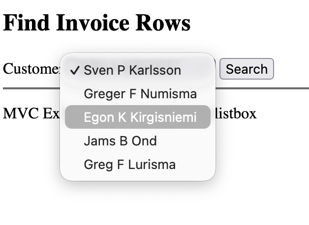

### Overview
This example shows how to make a dropdown for showing data using dotnet

## View

In the index view we make the dropdown. The action uses url.action to send the data to the SearchInvoiceRows method in the controller.

```html
<h2>Find Invoice Rows</h2>
<form method="post" action="@Url.Action("SearchInvoiceRows", "Home")">
    <label>
        Customer:
        <select name="custno">
            @foreach (var row in ViewBag.AllCustomersTable.Rows)
            {
                <option value="@row["CUSTNO"]">@row["NAME"]</option>
            }
        </select>
    </label>
    <input type="submit" value="Search" />
</form>
```

In the search result view we show t

## Controller

In the controller we pass the parameters to the model or show the search result

We read all customers and pass it to the view, in the same manner as if we were showing a table.

```c#
public IActionResult Index()
{
    ViewBag.AllCustomersTable = _customerModel.GetAllCustomers();
    return View();
}
```

In this case we have made a separate view for the search results page and we read the result from the model and pass it to the view. The customer number comes from the dropdown in the index view.

```c#
public IActionResult SearchInvoiceRows(string custno)
{
    ViewBag.SearchResults = _invoiceModel.SearchInvoiceRows(custno);
    return View();
}
```


## Model

In the model we make the delete statement, and the parameters are the same as sent from the controller
```c#
public void DeleteCustomer(string custno)
{
    MySqlConnection dbcon = new MySqlConnection(_connectionString);
    dbcon.Open();
    string deleteString = "DELETE FROM CUSTOMER WHERE CUSTNO=@CUSTNO;";
    MySqlCommand sqlCmd = new MySqlCommand(deleteString, dbcon);
    sqlCmd.Parameters.AddWithValue("@CUSTNO", custno);
    int rows = sqlCmd.ExecuteNonQuery();
    dbcon.Close();
}
```

## Screenshots

The application when executed looks like this


