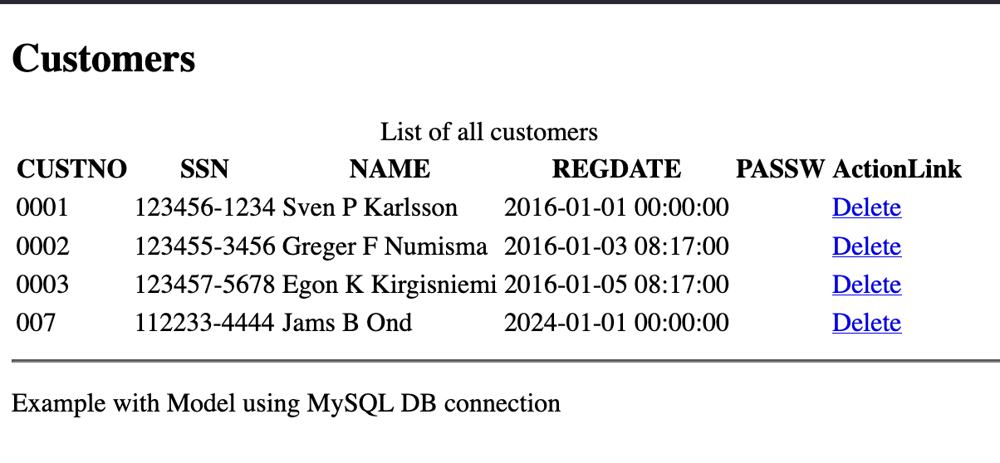
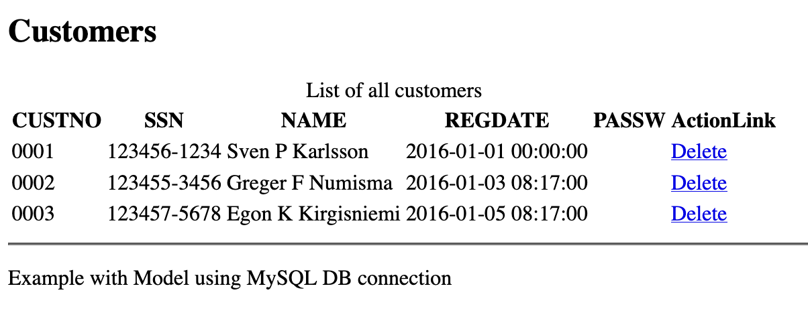

### Overview
This example shows how to make an insert using dotnet

## View

In the view we make a table like in the previous examples but we add a column with an action link that is based on the customer data in customerRow["custno"]

```html
<table>
    <caption>@tableHeader</caption>
    <tr>
        @foreach (DataColumn dataColumn in ViewBag.AllCustomersTable.Columns)
        {
            <th>@dataColumn.ColumnName</th>
        }
        <th>ActionLink</th>
    </tr>
    @foreach (DataRow customerRow in ViewBag.AllCustomersTable.Rows)
    {
        <tr>
            @for (int i = 0; i < ViewBag.AllCustomersTable.Columns.Count; ++i)
            {
                <td>@customerRow[i]</td>
            }
            <td>@Html.ActionLink("Delete", "DeleteCustomer", "Home", new { custno = customerRow["custno"] }, new { title = "Click to delete customer " + customerRow["NAME"] })</td>
        </tr>
    }
</table>
```

## Controller

In the controller we pass the parameters to the model or show the search result

```c#
public IActionResult DeleteCustomer(string custno)
{
    _customersModel.DeleteCustomer(custno);
    return RedirectToAction("Index");
}
```

## Model

In the model we make the delete statement, and the parameters are the same as sent from the controller
```c#
public void DeleteCustomer(string custno)
{
    MySqlConnection dbcon = new MySqlConnection(_connectionString);
    dbcon.Open();
    string deleteString = "DELETE FROM CUSTOMER WHERE CUSTNO=@CUSTNO;";
    MySqlCommand sqlCmd = new MySqlCommand(deleteString, dbcon);
    sqlCmd.Parameters.AddWithValue("@CUSTNO", custno);
    int rows = sqlCmd.ExecuteNonQuery();
    dbcon.Close();
}
```

## Screenshots

The application when executed looks like this


