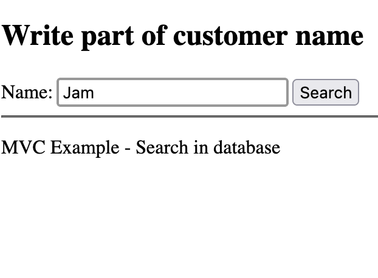
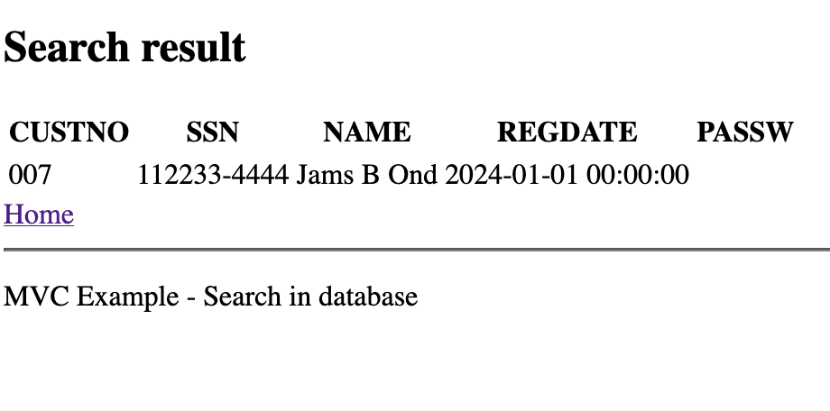

### Overview
This example shows how to make an insert using dotnet

## View

In the view we declare the form with the inputs named the same as the parameters in the controller / view. The url.action tells the engine which part of the code to send the form data to.

```html
<form method="post" action="@Url.Action("SearchCustomers", "Home")">
    <label>
        Name:
        <input type="text" name="name" value="" placeholder="Customer Name" />
    </label>
    <input type="submit" value="Search" />
</form>
```

## Controller

In the controller we pass the parameters to the model or show the search result

```c#
public IActionResult SearchCustomers(string name)
{
    ViewBag.SearchResults = _customersModel.SearchCustomers(name);
    return View();
}
```

## Model

In the model we make the select statement, and the parameters are the same as sent from the controller
```c#
public DataTable SearchCustomers(string name)
{
    MySqlConnection dbcon = new MySqlConnection(_connectionString);
    dbcon.Open();
    MySqlDataAdapter adapter = new MySqlDataAdapter("SELECT * FROM CUSTOMER WHERE name LIKE @NAME;", dbcon);
    adapter.SelectCommand.Parameters.AddWithValue("@NAME", "%" + name + "%");
    DataSet ds = new DataSet();
    adapter.Fill(ds, "result");
    DataTable CustomerTable = ds.Tables["result"];
    dbcon.Close();
    return CustomerTable;
}
```

## Screenshots

The application when executed looks like this


