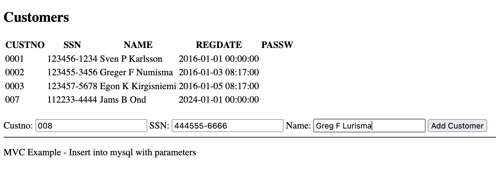
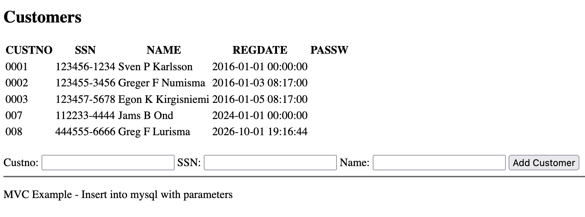

### Overview
This example shows how to make an insert using dotnet

## View

In the view we declare the form with the inputs named the same as the parameters in the controller / view.

```html
<form method="post" action="@Url.Action("InsertCustomer", "Home")">
    <label>Custno: <input type="text" name="custno"></label>
    <label>SSN: <input type="text" name="ssn"></label>
    <label>Name: <input type="text" name="name"></label>
    <input type="submit" value="Add Customer" />
</form>
```

## Controller

In the controller we pass the parameters to the model and redirect to the index page to show the result

```c#
public IActionResult InsertCustomer(string custno, string ssn,string name)
{
    _customersModel.InsertCustomer(custno,ssn,name);
    return RedirectToAction("Index");
}
```

## Model

In the model we make the insert, and the parameters are the same as sent from the controller
```c#
public void InsertCustomer(string custno, string ssn, string name)
{
    MySqlConnection dbcon = new MySqlConnection(_connectionString);
    dbcon.Open();
    string insertString = "INSERT INTO CUSTOMER(CUSTNO,SSN,NAME, REGDATE) VALUES(@CUSTNO,@SSN,@NAME,NOW());";
    MySqlCommand sqlCmd = new MySqlCommand(insertString, dbcon);
    sqlCmd.Parameters.AddWithValue("@CUSTNO", custno);
    sqlCmd.Parameters.AddWithValue("@SSN", ssn);
    sqlCmd.Parameters.AddWithValue("@NAME", name);
    int rows = sqlCmd.ExecuteNonQuery();
    dbcon.Close();
}
```

## Screenshots

The application when executed looks like this



