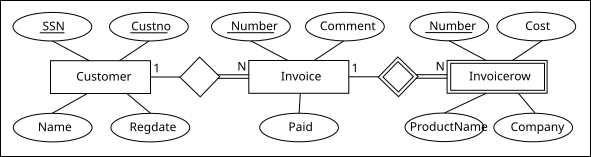

# Overview

A few lines on general features of content. 

Most importantly the given variant 

# ER model

Image of the chosen diagram in svg or png. When the model is constrained or we add features, update this consistently.

# Relations

**Customer**(<ins>Custno</ins>, SSN, Name, Regdate)
**Invoice**(<ins>Number</ins> , Comment, Paid, ~CustomerCustno~)
**InvoiceRow**(<ins>RowNumber,~InvoiceNumber~</ins> , Cost, ProductName, Company)

# Requirements

A few lines containing general description of requirements

## Customer

* First customer requirement
* Second customer requirement
* Third customer requirement

## Invoice

* First invoice requirement
* Second invoice requirement
* Third invoice requirement

## InvoiceRow

* First invoice row requirement
* Second invoice row  requirement
* Third invoice row requirement
